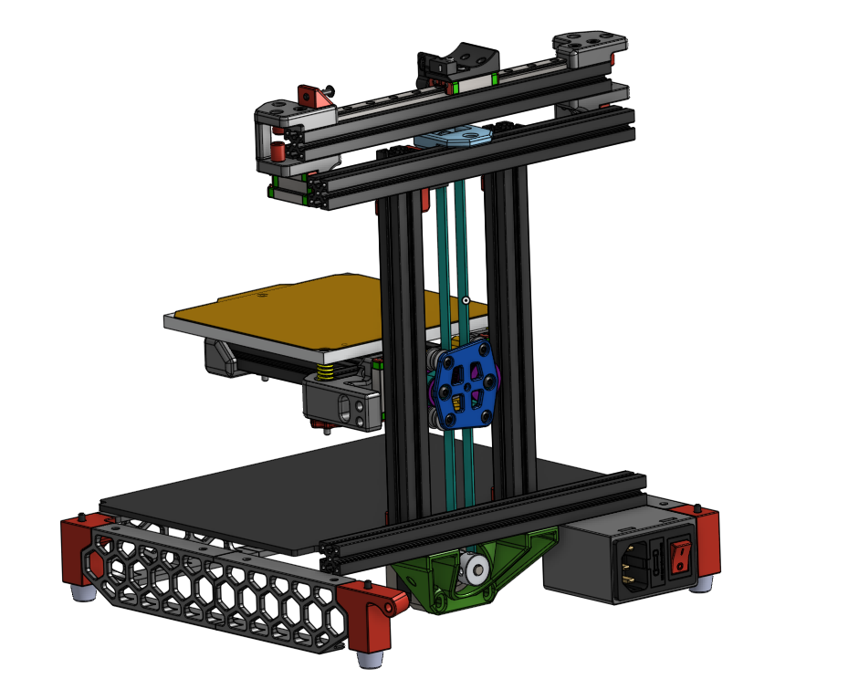

# V0-DBM
This is a differential pulley system belt mod for the Z-axis on Voron 0. 

NOTE: Alpha version and heavy work in progress! Some things are not yet tested, there WILL be road bumps ahead.

[See at Onshape](https://cad.onshape.com/documents/652155fb16d5bfa4e40363ce/w/0de7fce5d378ec45beba7939/e/0d8c25df57177126b288434d?renderMode=0&uiState=625118011183de28f2984f7c) | [Demonstration Video](https://www.reddit.com/r/VORONDesign/comments/txs1nn/what_do_you_guys_think_of_a_differential_pulley/?sort=new)

## What?
A differential pulley system! It is a long known pulley system for achieving extremely high mechanical advantage using just pulleys and a belt.
See the [Wikpedia](https://en.wikipedia.org/wiki/Differential_pulley) article for more information on how this pulley system works. In this case, I split up the central shaft (connecting the two unequal pulleys) into two shafts and connected them with a small belt. This way we eliminate the belt crossing.

## Why?
I wanted a V0 Belt mod, that eliminates the 80T pulley for stepping down the motion and increasing torque that is used in all other belt mods. In the differential pulley system, the "gear ratio" is integrated in the belt system. In this case, the two double pulleys have a teeth ratio of 24/30 (pulley A) and 24/32 (pulley B). According to the Wikipedia article, this results in the following mechanical advantage:

MA = 2/(1-r/R) = 2/(1-(24/30)*(24/32)) = 5

Together with the 20T motor pulley with 2mm pitch (i.e. 40mm per revolution), this achieves a 40mm/5=8mm per revolution Z-axis advance. The same as with the original leadscrew.

Also it looks cool and the mechanism is underrated.

## BOM
You need the following extra parts (is probably missing something):
- 20T pulley for stepper motor
- 20T toothed idler (with bearing ID 3mm)
- 2x M3x40 BHCS
- 5x M3x16 BHCS
- 3x M3x6 BHCS
- 4x M3x8 BHCS
- 22x 0.5mm shim washer
- 2GT belt 112mm
- 2GT belt 500mm

## ToDo
This repository is highly work in progress, the following things are still not satisfying:
- Idler mount may be a bit crude
- Moving-pulley-bed-part is rather crude
- No idea for well working belt tensioning mechanism on the small belt.
- Kirigami bed support planned
- Endstop problem is still unsolved

Feel free to use, open issues or leave alone :-)

